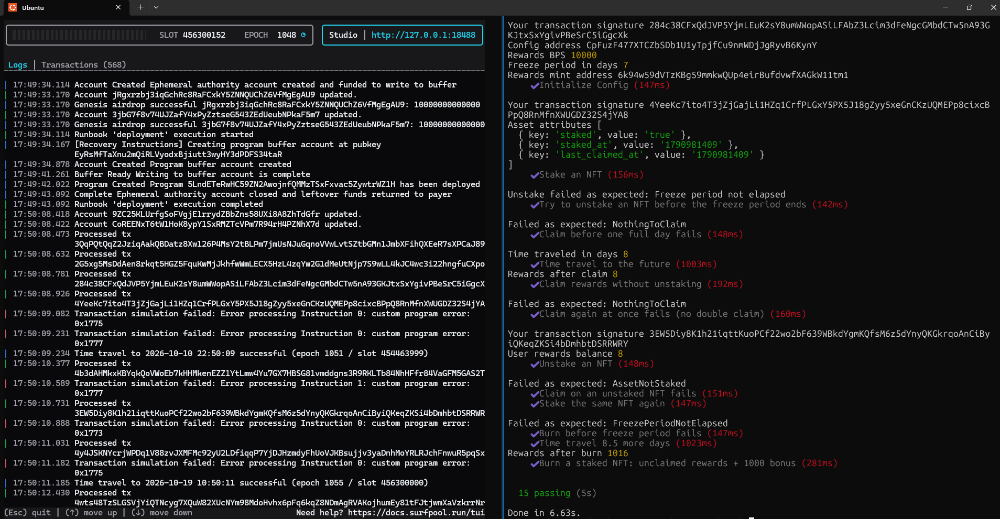

# Core NFT Staking

An NFT staking program on Solana for Metaplex Core assets, written with Anchor. It is based on the Turbin3 reference Core staking program, with claim without unstake, burn-to-earn, and a staking counter on the collection.

## Instructions

| Instruction | Description |
|---|---|
| `create_collection` | Creates a Core collection. |
| `mint_asset` | Mints an asset into the collection. |
| `initialize` | Creates the config and the rewards mint. |
| `stake` | Freezes the asset and adds the BurnDelegate. Adds 1 to `total_staked`. |
| `claim_rewards` | Mints the rewards. The asset stays staked and frozen. |
| `unstake` | Mints the unclaimed rewards and thaws the asset. Subtracts 1 from `total_staked`. |
| `burn_staked_nft` | Burns the asset. Mints the unclaimed rewards plus a bonus of 1,000 tokens. Subtracts 1 from `total_staked`. |

## Staking data

| Key | On | Used for |
|---|---|---|
| `staked` | Asset | Makes sure that the asset is staked. |
| `staked_at` | Asset | The freeze period. |
| `last_claimed_at` | Asset | The rewards. A claim moves it forward. |
| `total_staked` | Collection | The number of staked assets. |

All values are stored in the Attributes plugin. The program uses two timestamps, so that a claim does not restart the freeze period.

## Build and test

Requirements: Anchor 0.31.1, Solana CLI, Rust, Yarn, surfpool.

```bash
yarn install
anchor build

# Terminal 1
surfpool start

# Terminal 2, after the program is deployed
anchor test --skip-local-validator --skip-deploy --skip-build
```

Restart surfpool before each test run. The tests move the clock forward.

## Capture of test

